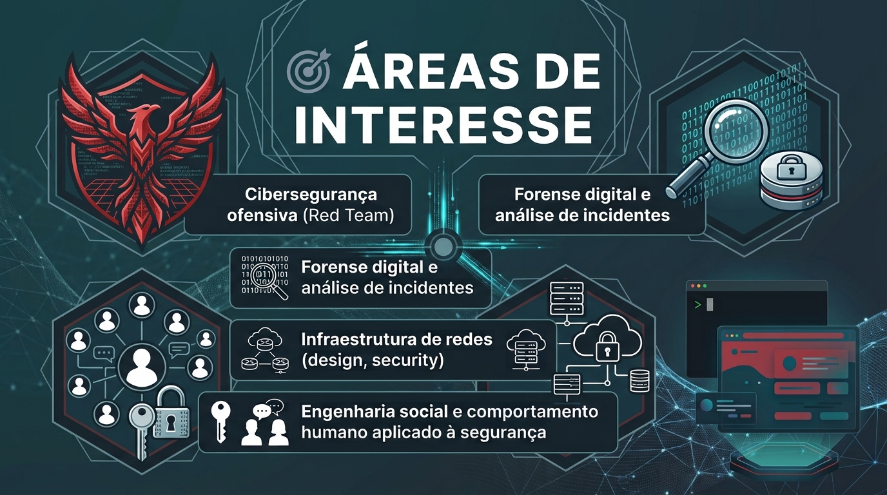

 

 

  

  

 

  

---

# Conecte-se comigo

---

# Habilidades

---

# Frameworks

---

# Cybersegurança

---

# Data & BI

---

# Sistemas Operacionais

# Monitoramento & Observabilidade

-----

🛠️ Pentest & Security

<o>

☁️ Cloud

 
<o>
&nbsp;

